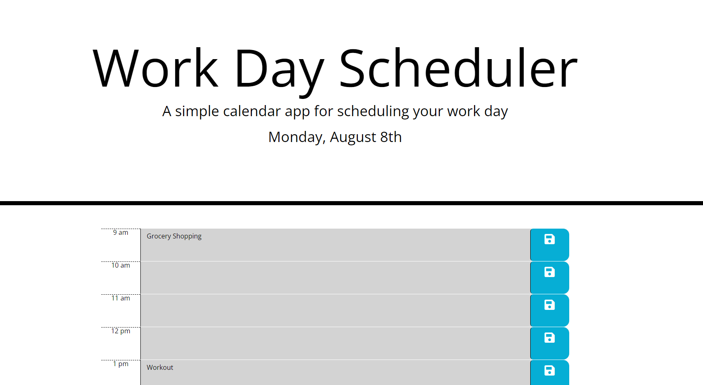

# Challenge-5

This is the fifth challenge of my UW coding bootcamp curriculum.

For this challenge, we had to follow the acceptance criteria to create a daily scheduler using moment.js.
The user is given the option to enter any text they desire in the hourly timeblocks set from 9 AM to 5 PM.
If the user presses the save button, the text will be saved to local storage and persist on page re-load.

This code was developed using starter code. Bootstrap was used for the HTML. Moment.JS and jquery were used for the JavaScript

View a screenshot of the scheduler below

View the deployed site [Here:](https://noahbrown26.github.io/Daily-Scheduler/)

